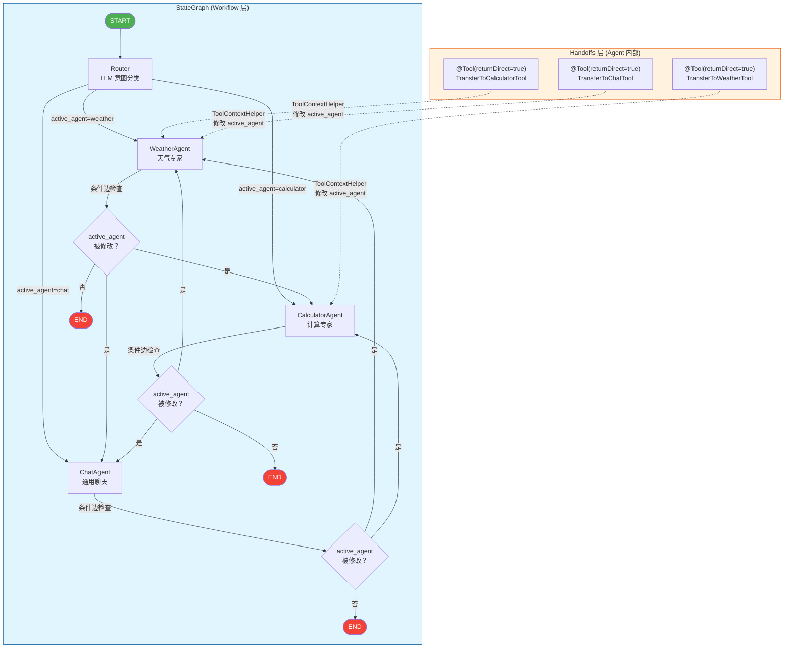
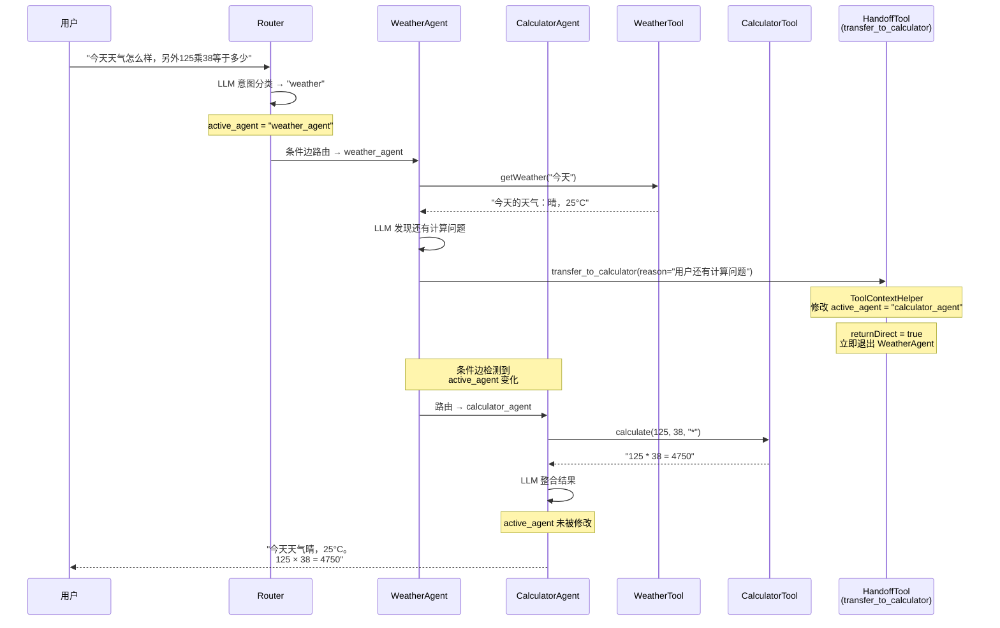

# Spring AI Alibaba 混合架构演示 (Workflow + Handoffs)

基于 Java 21 + Gradle (Groovy) + 阿里云镜像 + DeepSeek 模型的企业级多智能体混合架构项目。

## 架构概述

本项目实现了 **Workflow (StateGraph) + Handoffs (ToolContextHelper)** 的混合架构，参考官方 `examples/agentscope/handoffs` 示例。

### 架构图



### 两层职责

| 层 | 技术 | 职责 | 特性 |
|---|---|---|---|
| **Workflow** | `StateGraph` + `KeyStrategyFactory` + 条件边 | 定义节点拓扑和路由规则 | **确定性**：流程 100% 可控 |
| **Handoffs** | `@Tool(returnDirect=true)` + `ToolContextHelper` | Agent 内部动态修改 `active_agent` 状态 | **灵活性**：LLM 自主决策移交 |

### 智能体角色

| Agent | 领域工具 | 移交工具 | 职责 |
|-------|---------|---------|------|
| **WeatherAgent** | WeatherTool | → Calculator, → Chat | 天气/时间查询 |
| **CalculatorAgent** | CalculatorTool | → Weather, → Chat | 数学计算/汇率换算 |
| **ChatAgent** | 无（纯对话） | → Weather, → Calculator | 通用聊天兜底 |

## 快速开始

### 1. 配置环境变量

```powershell
# Windows PowerShell
$env:DEEPSEEK_API_KEY="your-api-key"
```

获取 Key：https://platform.deepseek.com/

### 2. 运行项目

```powershell
cd D:\AI\test2\demo-agent
gradle bootRun
```

### 3. 测试接口

```bash
# 天气查询（Router → WeatherAgent → END）
curl "http://localhost:8080/api/workflow/run?message=北京今天天气怎么样"

# 汇率换算（Router → CalculatorAgent → END）
curl "http://localhost:8080/api/workflow/run?message=100美元换算成人民币"

# 闲聊（Router → ChatAgent → END）
curl "http://localhost:8080/api/workflow/run?message=你好"

# 跨 Agent 移交（Router → WeatherAgent → Handoff → CalculatorAgent → END）
curl "http://localhost:8080/api/workflow/run?message=今天天气怎么样，另外125乘38等于多少"
```

## 项目结构

```
demo-agent/
├── build.gradle                          # Gradle 配置 (Groovy DSL)
├── settings.gradle                       # 项目设置 (阿里云镜像)
├── src/main/java/com/uid13/demo/
│   ├── DemoAgentApplication.java
│   ├── config/
│   │   ── HybridGraphConfig.java        # 核心：StateGraph + ReactAgent 编排
│   ├── state/
│   │   └── StateConstants.java           # 状态键常量 (active_agent 等)
│   ├── route/
│   │   ├── RouteInitialAction.java       # 初始路由 (LLM 意图分类)
│   │   ├── RouteAfterWeatherAction.java  # 天气节点后路由
│   │   ├── RouteAfterCalculatorAction.java # 计算节点后路由
│   │   └── RouteAfterChatAction.java     # 聊天节点后路由
│   ├── tools/
│   │   ├── WeatherTool.java              # 天气领域工具
│   │   ├── CalculatorTool.java           # 计算领域工具
│   │   ├── TransferToCalculatorTool.java # Handoff: → CalculatorAgent
│   │   ├── TransferToWeatherTool.java    # Handoff: → WeatherAgent
│   │   └── TransferToChatTool.java       # Handoff: → ChatAgent
│   ── controller/
│       ├── WorkflowController.java       # 工作流 API
│       └── IndexController.java          # 首页说明
└── src/main/resources/
    ├── application.yml                   # DeepSeek 配置
    └── logback-spring.xml                # 日志配置 (控制台 + 文件)
```

## 核心代码解析

### 1. KeyStrategyFactory（状态策略）

```java
KeyStrategyFactory keyStrategyFactory = () -> {
    HashMap<String, KeyStrategy> strategies = new HashMap<>();
    strategies.put("active_agent", new ReplaceStrategy());  // Handoff 覆盖
    strategies.put("messages", new AppendStrategy(false));   // 累积对话
    return strategies;
};
StateGraph graph = new StateGraph("hybrid_demo", keyStrategyFactory);
```

### 2. ReactAgent 作为子图节点

```java
graph.addNode("weather_agent", weatherAgent.getAndCompileGraph());
```

### 3. Handoff Tool（官方模式）

```java
@Tool(name = "transfer_to_calculator", returnDirect = true,
      description = "当用户问题涉及数学计算时，移交计算专家")
public String transferToCalculator(
        @ToolParam(description = "移交原因") String reason,
        ToolContext toolContext) {
    ToolContextHelper.getStateForUpdate(toolContext).ifPresent(update ->
            update.put("active_agent", "calculator_agent"));
    return "已移交计算专家：" + reason;
}
```

### 4. 条件边路由

```java
graph.addConditionalEdges("weather_agent",
    edge_async(state -> (String) state.value("active_agent").orElse("__END__")),
    Map.of("calculator_agent", "calculator_agent",
           "chat_agent", "chat_agent",
           "__END__", StateGraph.END));
```

## 执行流程示例

**输入**：`"今天天气怎么样，另外125乘38等于多少"`



## 技术栈

- Java 21
- Spring Boot 3.4.5
- Spring AI 1.1.2
- Spring AI Alibaba AgentScope 1.1.2.2
- DeepSeek v4-pro 模型
- Gradle 8.x (Groovy DSL，阿里云镜像加速)

## 参考文档

- [官方 Handoffs 示例](https://github.com/alibaba/spring-ai-alibaba/tree/main/examples/agentscope/handoffs)
- [Spring AI Alibaba GitHub](https://github.com/alibaba/spring-ai-alibaba)
- [DeepSeek 开放平台](https://platform.deepseek.com/)
