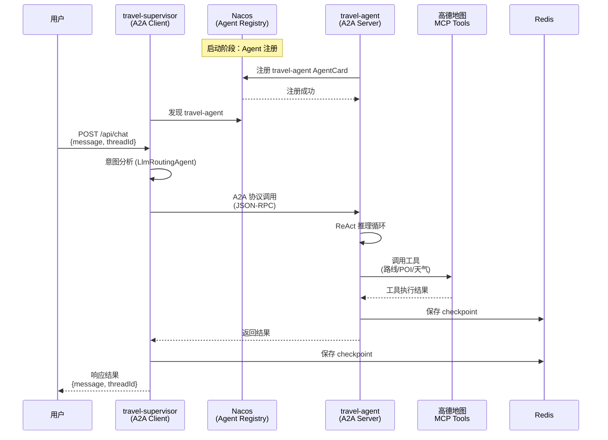

# Travel Assistant - 出行助手

基于 Spring AI Alibaba 的 A2A 分布式多 Agent 出行助手应用。

## 技术栈

| 组件 | 版本 | 说明 |
|------|------|------|
| Java | 21 | LTS 版本 |
| Spring Boot | 3.5.8 | Web 框架 |
| Spring AI | 1.1.2 | AI 集成框架 |
| Spring AI Alibaba | 1.1.2.2 | 阿里云 AI 组件（含 A2A） |
| Nacos | 3.2.2 | AI 注册中心（Agent Registry + Prompt 管理） |
| COLA DTO | 5.0.0 | 标准化响应体 |
| Redisson | 3.51.0 | Redis 客户端，多轮对话状态持久化 |
| Jasypt | 4.0.4 | 配置加密（API Key 等敏感信息） |
| Testcontainers | 1.21.2 | 测试容器 |
| Gradle | 8.14.5 | 构建工具 |
| 模型 | qwen3.7-max | 通义千问大模型 |

## 架构设计

### A2A 分布式多 Agent 架构



**流程说明**：
1. **启动阶段**：travel-agent 注册到 Nacos Agent Registry，travel-supervisor 通过 Nacos 发现 Agent
2. **请求阶段**：用户发送请求，Supervisor Agent 进行意图分析
3. **调用阶段**：Supervisor 通过 A2A 协议调用远程 travel-agent
4. **执行阶段**：TravelAgent 执行 ReAct 推理循环，调用高德 MCP 工具
5. **响应阶段**：结果沿调用链返回，Supervisor 整合并响应给用户

### 核心组件

| 模块 | 职责 | 关键类 |
|------|------|--------|
| travel-common | 公共模块 | AgentConstants, ChatDTO, HealthDTO, NacosPromptService |
| travel-agent | A2A Server | TravelAgent, CustomMcpTransportConfig |
| travel-supervisor | A2A Client | SupervisorAgent, TravelController, A2aAgentConfig |

### A2A 协议工作流程

1. **启动阶段**：travel-agent 启动后注册到 Nacos Agent Registry，暴露 AgentCard
2. **发现阶段**：travel-supervisor 启动后通过 Nacos 发现 travel-agent
3. **调用阶段**：Supervisor 接收用户请求，通过 A2A 协议调用远程 TravelAgent
4. **响应阶段**：TravelAgent 执行任务（调用 MCP 工具），返回结果给 Supervisor
5. **多轮对话**：Supervisor 使用 RedisSaver 实现会话状态持久化

## 快速开始

### 环境要求

- JDK 21+
- Docker（可选，用于 Redis）
- Nacos 3.2.2
- Redis 7.x
- 阿里云百炼 API Key（DashScope）
- 高德地图 API Key

### 配置敏感信息

项目使用 Jasypt 加密敏感配置，通过环境变量提供解密密钥：

```bash
# Windows PowerShell
$env:JASYPT_ENCRYPTOR_PASSWORD="your-password"

# Linux/Mac
export JASYPT_ENCRYPTOR_PASSWORD=your-password
```

### 启动应用

#### 方式一：IDE 启动

1. 先启动 Nacos 和 Redis
2. 启动 travel-agent：`TravelAgentApplication.main()`
3. 启动 travel-supervisor：`SupervisorApplication.main()`

#### 方式二：命令行启动

```bash
# 构建项目
./gradlew build

# 启动 travel-agent（A2A Server）
cd travel-agent
../gradlew bootRun

# 启动 travel-supervisor（A2A Client）
cd travel-supervisor
../gradlew bootRun
```

### 验证 Nacos 注册

访问 Nacos 控制台：`http://192.168.0.100:8848/nacos`

进入 **AI 注册中心 → Agent 管理**，确认 `travel-agent` 已注册。

### API 接口

#### 聊天接口（支持多轮对话）

```bash
# 首轮对话（不传 threadId，服务端自动生成）
curl -X POST http://localhost:8081/api/chat \
  -H "Content-Type: application/json" \
  -d '{"message": "查一下明天北京的天气"}'

# 多轮对话（使用 threadId 保持上下文）
curl -X POST http://localhost:8081/api/chat \
  -H "Content-Type: application/json" \
  -d '{"message": "帮我规划一条从北京到上海的路线", "threadId": "abc-123"}'
```

**响应**：
```json
{
  "success": true,
  "data": {
    "message": "明天北京天气晴朗，气温 15-25°C...",
    "agent": "travel-supervisor",
    "threadId": "abc-123-def"
  }
}
```

#### 健康检查

```bash
curl http://localhost:8081/api/health
```

## 配置说明

### travel-supervisor 配置

| 配置项 | 说明 | 默认值 |
|--------|------|--------|
| `server.port` | 服务端口 | 8081 |
| `spring.ai.dashscope.api-key` | 百炼 API Key（Jasypt 加密） | - |
| `spring.ai.dashscope.chat.options.model` | 模型名称 | qwen3.7-max |
| `spring.ai.alibaba.a2a.nacos.server-addr` | Nacos 地址 | 192.168.0.100:8848 |
| `spring.ai.alibaba.a2a.nacos.discovery.enabled` | 启用 A2A 发现 | true |
| `spring.data.redis.host` | Redis 地址 | localhost |
| `jasypt.encryptor.password` | Jasypt 密码（环境变量） | - |

### travel-agent 配置

| 配置项 | 说明 | 默认值 |
|--------|------|--------|
| `server.port` | 服务端口 | 8082 |
| `spring.ai.dashscope.api-key` | 百炼 API Key（Jasypt 加密） | - |
| `spring.ai.dashscope.chat.options.model` | 模型名称 | qwen3.7-max |
| `spring.ai.mcp.client.enabled` | 启用 MCP 客户端 | true |
| `spring.ai.mcp.client.streamable-http.connections` | MCP 连接配置 | {} |
| `spring.ai.alibaba.a2a.nacos.server-addr` | Nacos 地址 | 192.168.0.100:8848 |
| `spring.ai.alibaba.a2a.service.nacos.*` | A2A 服务注册配置 | - |
| `amap.api.key` | 高德 API Key（Jasypt 加密） | - |

### Nacos Prompt 管理

Agent 提示词通过 Nacos AI 注册中心的 Prompt 管理功能集中维护：

| Prompt Key | 用途 | 常量 |
|------------|------|------|
| `travel-agent-prompt` | 出行规划 Agent 提示词 | `AgentConstants.TRAVEL_AGENT_PROMPT` |
| `supervisor-agent-prompt` | 主管 Agent 提示词 | `AgentConstants.SUPERVISOR_AGENT_PROMPT` |

提示词内容使用 Markdown 格式，在 Nacos 控制台 **AI 注册中心 → Prompt 管理** 中编辑和发布。

## 项目结构

```
travel/
├── build.gradle                 # 父项目配置（公共配置、依赖管理）
├── settings.gradle              # 多模块配置
├── LICENSE
├── README.md
├── AGENTS.md                    # 开发指南
├── docs/                        # 文档目录
│   ├── A2A-MIGRATION.md        # A2A 改造说明
│   ├── supervisor-agent-prompt.md
│   └── travel-agent-prompt.md
├── travel-common/               # 公共模块
│   ├── build.gradle
│   └── src/main/java/com/uid13/travel/common/
│       ├── constant/
│       │   └── AgentConstants.java          # Agent 名称和 Prompt Key 常量
│       ├── dto/
│       │   ├── ChatDTO.java                 # 聊天响应 DTO
│       │   └── HealthDTO.java               # 健康检查 DTO
│       └── service/
│           └── NacosPromptService.java      # Nacos Prompt 服务
├── travel-agent/                # A2A Server 应用
│   ├── build.gradle
│   └── src/main/
│       ├── java/com/uid13/travel/agent/
│       │   ├── TravelAgentApplication.java  # 启动类
│       │   ├── TravelAgent.java             # 出行规划 Agent
│       │   └── config/
│       │       └── CustomMcpTransportConfig.java  # 自定义 MCP Transport
│       └── resources/
│           ├── application.yml              # 配置文件
│           └── logback-spring.xml           # 日志配置
└── travel-supervisor/           # A2A Client 应用
    ├── build.gradle
    └── src/
        ├── main/
        │   ├── java/com/uid13/travel/supervisor/
        │   │   ├── SupervisorApplication.java   # 启动类
        │   │   ├── agent/
        │   │   │   └── SupervisorAgent.java     # 主管 Agent（LlmRoutingAgent）
        │   │   ├── config/
        │   │   │   ├── A2aAgentConfig.java      # A2A Agent 配置
        │   │   │   ├── GlobalExceptionHandler.java
        │   │   │   └── RedisConfig.java
        │   │   └── controller/
        │   │       └── TravelController.java    # REST 控制器
        │   └── resources/
        │       ├── application.yml              # 主配置
        │       ├── application-redis.yml        # Redis 配置
        │       └── logback-spring.xml
        └── test/
            └── http/
                └── travel-chat.http             # HTTP 测试文件
```

## 许可证

MIT License
